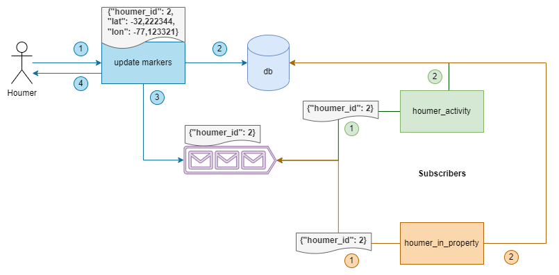

# Houmer Markers

Solución al desafío planteado por Houm, para obtener métricas sobre sus Houmers

La solución planteada, se conforma de:

* Base de datos MySQL
* Broker RabbitMQ
* FastAPI
* Docker

Dado que hay "n" houmers y estos envían sus coordenadas cada "t" tiempo, el diseño lógico de la solución es el siguiente:




## Consideraciones

### Generales

- Existencia de un servicio auth para consumir este servicio.

### Particulares
El servicio REST debía resolver lo siguiente:

1.- Permita que la aplicación móvil mande las coordenadas del Houmer.

* Para esto se considera que las coordenadas son bajo el formato de latitud y longitud.

2.- Para un día retorne todas las coordenadas de las propiedades que visitó y cuanto tiempo se quedó en cada una

* Para calcular la distancia entre 2 coordenadas, se usa la fórmula de Haversine.
* Para determinar si el houmer está o no en una propiedad, se define una distancia de 40 metros.
* Si existen más de 1 propiedad que cumpla con ese criterio, todas quedarán como "visitadas" por el houmer (departamentos en un mismo edificio, por ejemplo)-

3.- Para un día retorne todos los momentos en que el houmer se trasladó con una velocidad superior a cierto parámetro

* Se define la velocidad en km/hr.


## Ejecución en ambiente local

Para ejecución de los servicios en ambiente local para **desarrollo**, hacer:


0.- Clonar proyecto

```
git clone https://github.com/felipesanma/houmer-markers.git
```

1.- Entrar al directorio "houmer-markers". Levantar mysql y rabbitmq:

```
docker-compose -f extra-utils.yml up
```

Se encontrará operativo cuando se vean las siguientes líneas:

```
database_1  | 2022-02-10T20:35:25.841618Z 0 [Note] mysqld: ready for connections.
rabbitmq_1  | Server startup complete; 6 plugins started.

```
2.- Esperar a que se levante correctamente lo del paso 1. Luego, ejecutar:

```
docker-compose up
```

Se encontrará operativo cuando se vea lo siguiente:
```
houmerapi_1 | INFO: Application startup complete.
```

## Documentación

Una vez levantado, dirigirse a: http://localhost:8080/redoc

Se encontrará toda la documentación asociado al consumo de los servicios REST.

## Test Data

Para la inyección de datos con localizaciones de propiedades, revisar el siguiente [jupyter notebook](https://github.com/felipesanma/houmer-markers/blob/master/data/Get%20Properties%20Data%20-%20Houm_Challenge.ipynb)


## To do

1. Configuración de log files.
2. Documentación para uso en producción (con ECS, bajo un pipeline en gitlab).
3. Test del código.
4. Generación de data para houmers de forma random.
